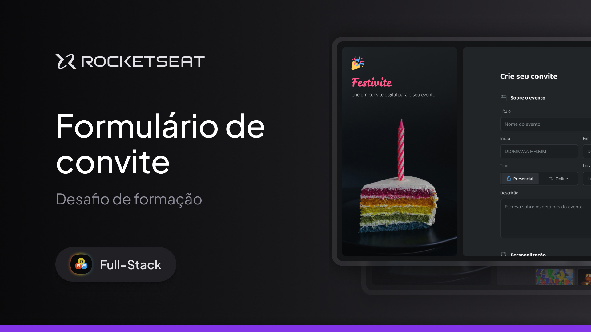

# Formação Full-Stack: Formulário de convite

Acesse em: <a href="https://limacaiquelg.github.io/fullstack-formulario-convite/">https://limacaiquelg.github.io/fullstack-formulario-convite/</a>

 

Este projeto consiste em uma página web desenvolvida utilizando HTML, CSS e JavaScript. Esta página exibe um formulário complexo para criação de convites personalizados, com diversos tipos de campos de entrada, checkboxes, radio buttons, etc.
 

Os seguintes tópicos são trabalhados nesta aplicação: 

<ul>
  <li>Formulários HTML</li>
  <li>Inputs de texto</li>
  <li>Estilização de inputs com CSS</li>
  <li>Inputs de data</li>
  <li>Radio buttons</li>
  <li>Estilização de formulários com CSS</li>
</ul>

A utilização de JavaScript não estava no escopo do projeto, entretanto, revelou-se necessária para o pleno funcionamento de um campo de envio de arquivo personalizado. Também foi criada uma máscara para um campo de telefone.

Este projeto faz parte da formação Full-Stack da <a href="https://www.rocketseat.com.br">Rocketseat</a>.
